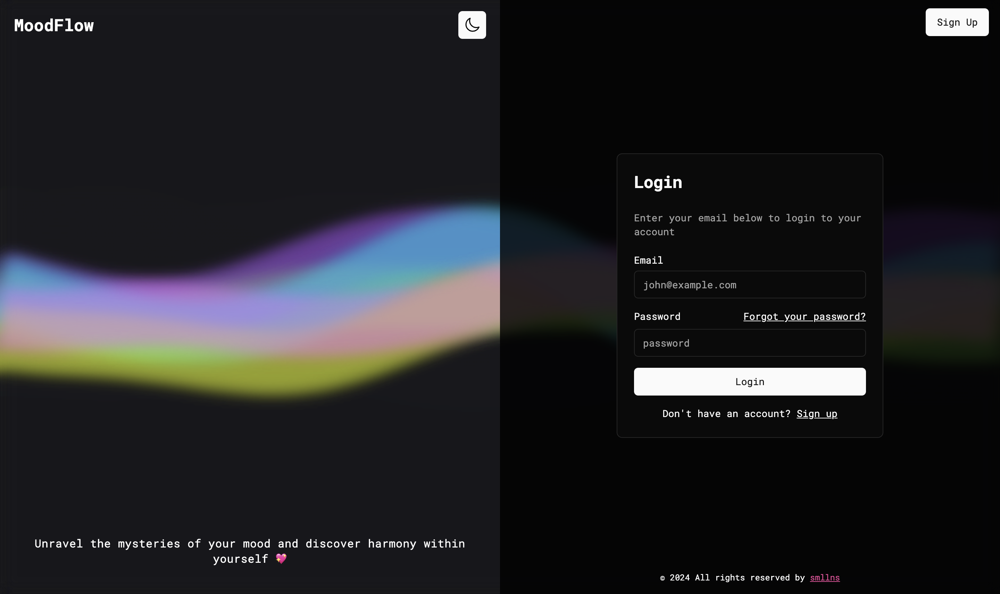
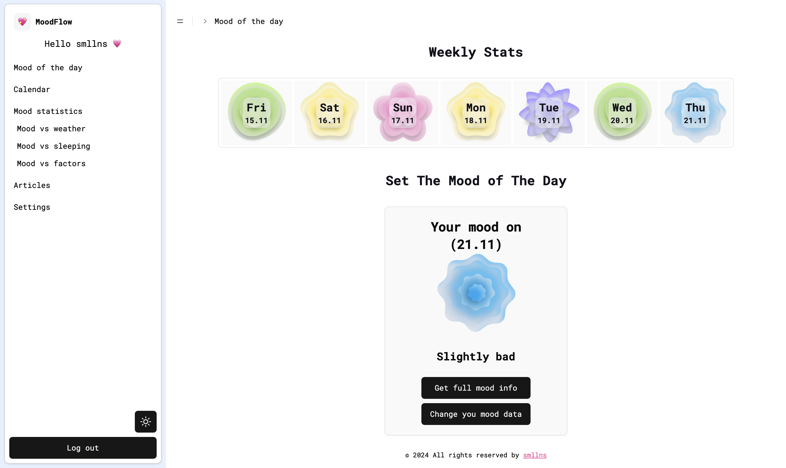
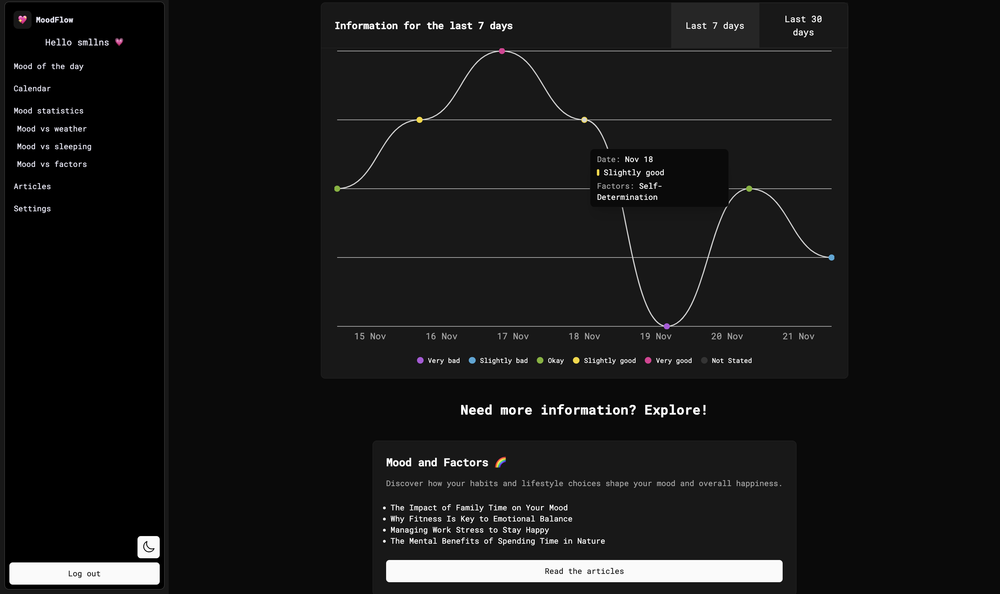

# MoodFlow

Welcome to **MoodFlow** – a mood tracker app that helps you track and analyze your emotional state over time. This app allows you to log your moods for different days, visualize them through charts, and explore insightful articles related to mood and mental health. **MoodFlow** is fully responsive, features both light and dark modes, and is built using **React (Next.js)**, **TypeScript** and **TailwindCSS**.

## Table of Contents

- [About the Project](#about-the-project)
- [Key Features](#key-features)
- [Technologies Used](#technologies-used)
- [Demo](#demo)
- [Contact](#contact)

## About the Project

**MoodFlow** is a comprehensive mood tracker designed to help users monitor their emotional well-being. The app allows you to log your mood for any given day and presents the data through visually appealing charts using **Recharts**. It also features a variety of mood-related articles for self-improvement and better understanding of emotional health.

The app is fully **responsive**, supports both **light** and **dark** themes (powered by **TailwindCSS**), and ensures a smooth, engaging user experience. MoodFlow is built with a modern tech stack including **React**, **Next.js**, and **Firebase** for user authentication and data storage.

## Key Features

- **Mood Tracking**: Log your mood for each day and track emotional patterns over time.
- **Interactive Charts**: View your mood data through customizable charts and graphs powered by **Recharts**.
- **Custom Calendar**: Track moods directly on a custom, interactive calendar built with **React DayPicker**.
- **User Data Table**: Access a complete view of your mood data, displayed in an interactive and customizable table using **TanStack Table**.
- **Responsive Design**: Optimized for mobile, tablet, and desktop views.
- **Dark and Light Themes**: Switch between dark and light themes with ease using **TailwindCSS**.
- **Authentication**: Secure user login and data storage through **Firebase**.
- **Account Management**: Update your profile, including **name**, **email**, **username**, and **password**; delete your account or clear all mood data from within the app.
- **Articles & Resources**: Read mood-related articles to learn more about managing mental health.
- **ShadCN Components**: A collection of reusable, accessible UI components from **ShadCN** for a smooth UI/UX experience.
- **PDF Export**: Export your mood data and history as a PDF using **jsPDF**.

## Technologies Used

- **React (Next.js)**: Framework for building the app’s user interface, providing server-side rendering and static site generation.
- **TypeScript**: Ensures type safety and improves code quality.
- **TailwindCSS**: For styling, including custom themes and responsive layouts.
- **ShadCN**: UI components library for building accessible and customizable components.
- **Aceternity UI Library**: Customizable UI components used in the Hero section of the project.
- **Recharts**: For rendering interactive charts and graphs based on mood data.
- **Firebase**: Provides user authentication and data storage for persistent mood tracking.
- **Framer Motion**: Used to add smooth animations and transitions to the UI.
- **React DayPicker**: For creating a custom calendar interface to select dates for mood tracking.
- **React Hook Form**: For handling form submissions efficiently.
- **TanStack Table**: For displaying detailed information about the user's mood data in a customizable and interactive table format.
- **Zod**: For schema validation and form data validation alongside React Hook Form.
- **Simplex Noise**: For generating dynamic, animated background waves.
- **jsPDF**: Used to generate and export user data to PDF format for download.

## Demo

You can try the live version of **MoodFlow** here:

[Live Demo](https://moodflow-by-smllns.vercel.app/) 

## Contact

Feel free to reach out for any questions, suggestions, or opportunities!

- **Email**: [marysmoly@gmail.com](mailto:marysmoly@gmail.com)
- **LinkedIn**: [LinkedIn Profile](https://www.linkedin.com/in/smllns/)
- **GitHub**: [GitHub Profile](https://github.com/smllns)
